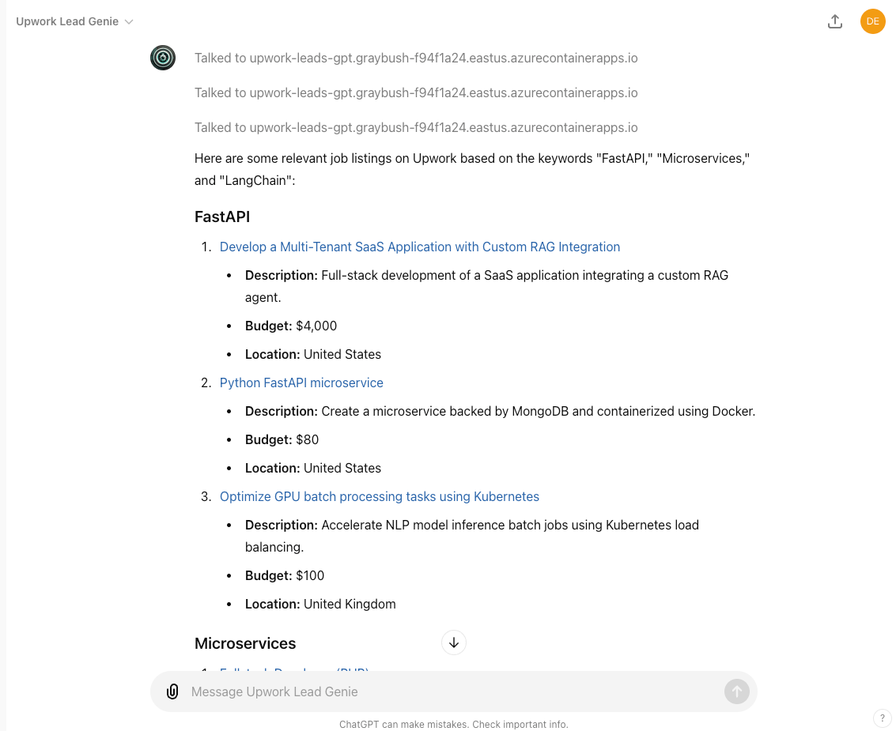

# Upwork Genie GPT

Connect to Upwork, find the most relevant jobs based on your skills or keywords, and generate tailored proposals using the latest strategies and insights.

**Live Link**
[Upwork Genie - Live GPT](https://chatgpt.com/g/g-2ti56xXvK-upwork-lead-genie)

## Business Value

**Maximize your Upwork success with optimized job searches and proposal generation..**

### Demo Media


## Concept

Upwork Genie is an AI-powered tool built using OpenAI’s CustomGPT, designed to enhance freelancers' success on Upwork. It searches for the most relevant job postings based on provided keywords or the user's skillset and generates customized proposals by analyzing top-performing examples.

This GPT system not only saves time by automating the job search process but also increases the chances of winning projects by using the latest proposal strategies. Remember, always use the browsing tool to check for the most current templates and strategies by searching terms like "Upwork Proposal Reddit" at least three times before finalizing any proposal.

Important Note: Upwork Genie is designed as a Proof of Concept (POC) and is NOT recommended for production environments due to potential security risks.

**Live Link**
[Upwork Genie - Live GPT](https://chatgpt.com/g/g-2ti56xXvK-upwork-lead-genie)

### Features
- Smart JobSearch: Automatically finds relevant Upwork job postings based on keywords or your skillset.
- Proposal Optimization: Generates proposals using a database of successful templates and strategies, with a focus on the latest trends from sources like "Upwork Proposal Reddit."
- Browsing Tool Integration: Before crafting any proposal, always use the browsing tool to fetch the latest templates and insights, repeating this process three times.
- Personalized Recommendations: Provides tailored job and proposal suggestions to align with your specific strengths and expertise.

## Local Setup Instructions

### Prerequisites
- Docker
- Docker Compose

### Setup Instructions

0. Get an Upwork RSS Feed URL and extract security_token, user_uid and org_uid . Add them to main.py at line 31 - 35:
```
    security_token = "&securityToken="
    user_uid = "&userUid="
    org_uid = "&orgUid="
```

1. Clone the Repository
```bash
git clone [your-repository-url]
cd [your-repository-folder]
```

2. Build and Run Services
Run the following command to start all services, including the Cloudflare tunnel:

```bash
docker-compose up --build
```
The service will be accessible at http://localhost:9022/.

3. Get CloudFlare Tunnel URL

In the logs, you will find the CloudFlare URL, which will look something like this:

```sql
--------------------------------+
cloudflared-1           | 2024-06-16T17:55:13Z INF |  Your quick Tunnel has been created! Visit it at (it may take some time to be reachable):  |
cloudflared-1           | 2024-06-16T17:55:13Z INF |  https://walt-roll-protecting-silly.trycloudflare.com                                      |
cloudflared-1           | 2024-06-16T17:55:13Z INF +--------------------------------------------------------------------------------------------+
```

Copy this URL and update your main.py and updated app = FastAPI(...) accordingly.

Now open in browser visit /docs to try it out. Next 

### GPT Actions and API Endpoints
Available Actions
Fetch Relevant Jobs:

Method: GET
Path: /fetch_jobs
Description: Fetches the most relevant Upwork job listings based on provided keywords.
Parameters:
q: The keyword or skill to search for jobs.
Generate Proposal:

Method: POST
Path: /generate_proposal
Description: Generates a customized proposal based on the selected job.
Parameters:
job_link: The URL of the Upwork job posting.
user_skills: A description of the user's skills for tailoring the proposal.
Usage Example
Give your GPT a name, description, instructions. Once your GPT instance is live, you can interact with Upwork Genie using the following starter prompts:

### Starter Prompts

"Find relevant jobs for my skills."
Example: "Find relevant jobs for Python and AI development."
"Generate a proposal for this Upwork job."
Example: "Generate a proposal for the AI Backend Developer role: https://upwork.com/jobs/Backend-Developer"
Always remember to use the browsing tool to check for the latest proposal templates and strategies by searching terms like "Upwork Proposal Reddit" at least three times before submitting any proposal.